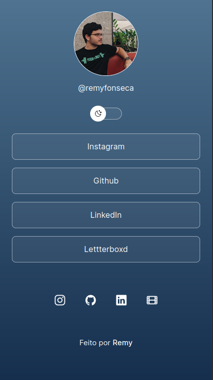

<h1> 💻 Social-Tree </h1>

 O Social-Tree é um projeto que visa organizar os links para as redes sociais, permitindo que os usuários acessem facilmente as redes sociais do dono da página.

[Acesse a página do projeto 🔗](https://remyfonseca.github.io/social-tree/)

<h1> 🚀 Tecnologias </h1>
<ul>
<li> HTML </li>
<li> CSS </li>
<li> Javascript </li>
</ul>
<h1> 📷 Projeto </h1>

    

